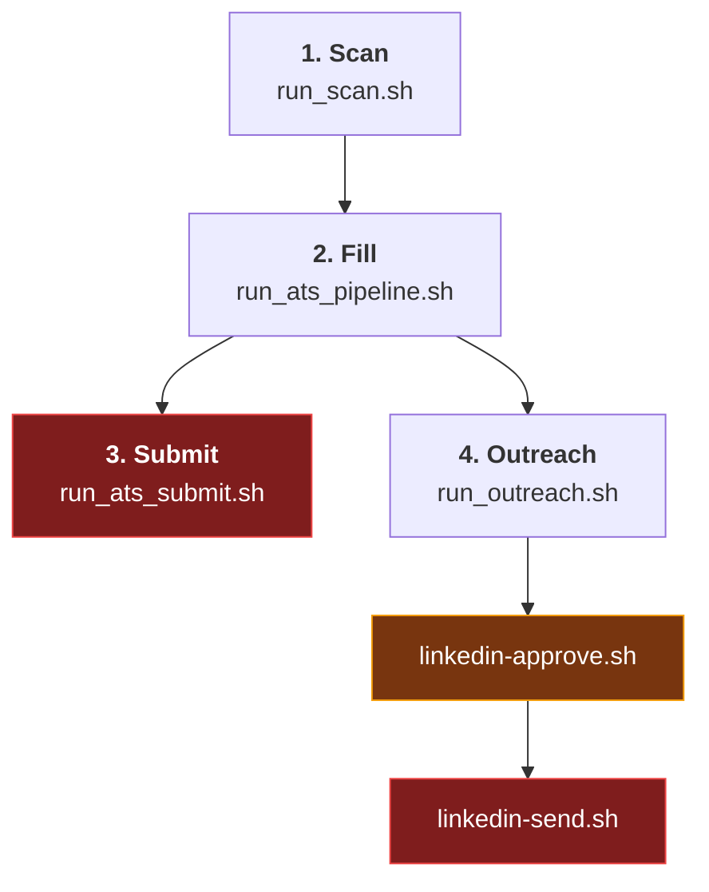

# job-fill-autopilot

A job-search pipeline that runs end to end: it finds postings across several
sources, throws out the ones you aren't eligible for, writes a resume tailored
to each surviving posting, fills the employer's application form in a real
browser, and drafts LinkedIn outreach to a human at that company.

Filling and submitting are deliberately separate commands. Nothing is sent to
another person without an explicit approval step.

> ### Built on career-ops
>
> This repository is a derivative work of
> **[career-ops](https://github.com/santifer/career-ops)** by
> **Santiago Fernández de Valderrama**, used under the MIT license and based on
> upstream v1.19.0. The scan engine, evaluation modes, plugin system, and most
> of the documentation are his work.
>
> What this repo adds is an **application-submission layer** and an **outreach
> layer** — see [What this fork adds](#what-this-fork-adds).
>
> Full breakdown in [`NOTICE.md`](NOTICE.md) · original upstream README kept at
> [`README.career-ops.md`](README.career-ops.md). Not affiliated with or
> endorsed by the upstream project.

---

## The pipeline



Red stages are irreversible. Amber is a human decision. Each is its own
entrypoint, so no single trigger can walk the whole chain.

### 1. Scan — `./run_scan.sh`

Zero-LLM, safe for cron. Chains:

| Step | Does |
|---|---|
| `scan.mjs` | ATS APIs plus LinkedIn / JobSpy / JobRight local parsers, all driven by `portals.yml` |
| `post_scan_normalize.py` | Normalizes the date field, moves new entries to the top |
| `experience_gate.py` | Drops postings that require more experience than you have |
| `jobright_relink.py` · `linkedin_relink.py` | Repair passes: resolve aggregator links to the employer's real apply URL |
| `experience_gate.py --all-pending` | Re-gates everything now that URLs are repaired |
| `dedup_pipeline.py` | Collapses duplicates, resyncs the CSV, asserts the result is duplicate-free |

Every source — including JobSpy and JobRight — goes through the *same* gates:
`title_filter`, `content_filter`, `location_filter`, the blacklist, scan-history
dedup, then the experience gate.

**The experience gate** fetches JD text with zero tokens (Greenhouse, Lever,
Ashby, Workday CXS, amazon.jobs, Workable, LinkedIn guest endpoint, generic HTML
strip for everything else), regexes out the minimum years required, and drops
anything above `experience_filter.max_required_years`. A "new grad" marker in the
*title* is not enough — the marker has to be in the fetched JD body. Every JD it
pulls is cached to `Job_applicator/jd/{slug}.txt`, so gating doubles as the
extraction pass instead of fetching twice.

**Deduplication** collapses three classes, in order:

1. Same URL after canonicalization (`?utm_campaign=A` vs `?utm_campaign=B`)
2. Same ATS/board job ID (`/jobs/view/4448290187` vs `/jobs/view/ml-engineer-at-x-4448290187`)
3. Same company + normalized title — the same role surfaced by Indeed, LinkedIn,
   and the employer's own Greenhouse board, which classes 1–2 can't see

Class 3 only merges rows dated within `--window` days (default 45), so a role
genuinely reposted months later stays visible as signal.

### 2. Fill — `./run_ats_pipeline.sh`

Scans, diffs the pipeline for new ATS rows, then for each one: tailors a resume,
fills the form, and drafts a LinkedIn note. **It does not submit** — `--submit`
exists but is off by default. `flock`-guarded so runs can't overlap.

### 3. Submit — `./run_ats_submit.sh`

The only thing in the repo that clicks Submit, and a separate entrypoint on
purpose: filling is reversible, submitting is not.

The filler leaves the tab open with the form filled. The submitter returns to
*that* tab, re-reads the form as it stands right now, shows you what's on it, and
clicks Submit only after approval. That means hand-edits you make in the open tab
are first-class — the audit reads the live page rather than replaying what the
filler thought it wrote.

It refuses to submit when:

- the tab for that posting is gone (the filled form went with it)
- a required field is empty, or the form shows a validation error
- the attached resume is the generic one rather than the tailored PDF
- the slug was already submitted

`--force` overrides the audit, never the already-submitted check. Run
`./run_ats_submit.sh --list` to see what's waiting.

### 4. Outreach — `./run_outreach.sh`

For postings that actually submitted, find a relevant human and draft a note.
Drafting and sending are three separate scripts on purpose: **the drafting script
has no send-capable tool in its allowlist, and the sender independently refuses
any slug whose queue status is not `approved`.** A freshly generated draft
defaults to *do not send*.

```bash
./run_outreach.sh                      # draft -> status: pending_approval
./linkedin-approve.sh <slug> approve   # human decision
./linkedin-send.sh <slug>              # refuses unless approved
```

`alumni-referrals.mjs` is the same shape for referrals: it finds alumni from your
school at companies already in your pipeline and drafts an ask for each. `scan`,
`drafts`, and `queue` never contact anyone; only `send` transmits, and only for
drafts whose `**Send:**` line says `yes`.

---

## Resume tailoring

`Job_applicator/tailor_resume.sh <slug>` turns `jd/<slug>.txt` into
`resumes/<slug>.pdf`:

| # | Step | LLM? |
|---|---|---|
| 1 | `jd-skill-gap.mjs` — skill buckets (informational) | no |
| 2 | `tailor_resume_local.mjs` — selects content from `content-bank.yml` | no |
| 3 | `review_resume_patch.mjs` — one single-shot patch call, fail-open | **yes** |
| 4 | `build-cv-html.mjs` — deterministic render, owns all markup | no |
| 5 | `verify-cv-facts.mjs` — hard gate against invented metrics | no |
| 6 | `generate-pdf.mjs` — Playwright HTML→PDF | no |

**Tailoring cannot invent experience.** Every bullet is selected from a content
bank whose strings trace back to `cv.md`; metrics are character-exact so
`verify-cv-facts.mjs` can fail the build if anything drifted. If a gate rejects
the reviewed payload, it retries from the unpatched deterministic draft, which is
built purely from `cv.md`-backed strings. Output is capped at 2 pages.

Doing the deterministic selection in step 2 rather than asking a model to rewrite
the resume from scratch cut the cost from **~$2.58 and ~248k input tokens per
resume to ~$0.02 and ~5k**.

---

## What this fork adds

Roughly 23,000 lines not present in any upstream revision.

| Area | Paths |
|---|---|
| ATS auto-fill & submission | `Job_applicator/` — Workday, Greenhouse, Lever, Ashby, Amazon Jobs, LinkedIn Easy Apply |
| Question answering | `Job_applicator/ats_questions.mjs`, `collect_questions.py` — maps application questions onto a fixed answer bank |
| Captcha handling | `Job_applicator/captcha_relay.mjs` — hands control to a human rather than defeating the challenge |
| LinkedIn outreach | `Job_applicator/linkedin_*`, `send_outreach_batch.mjs`, `run_outreach.sh` |
| Alumni referrals | `alumni-referrals.mjs`, `run_alumni.sh` |
| Listing ingestion | `jobright*.py`, `jobspy*.py`, `speedyapply_scan_parser.py`, `linkedin_*.py`, `Webscrapper/` |
| Pipeline plumbing | `experience_gate.py`, `dedup_pipeline.py`, `jd_extract.py`, `scan_ats.py`, `scan_common.py`, `post_scan_normalize.py`, `sync_pipeline_csv.py`, `batch-ats-fill.mjs` |

---

## Setup

**Requirements:** Node 20+, Python 3.12+, and a Chrome running with
`--remote-debugging-port=9226`.

```bash
git clone https://github.com/Saketh1997/job-fill-autopilot.git
cd job-fill-autopilot
npm install
node doctor.mjs          # verifies the environment
```

The browser is shared with the fill/submit scripts, so a portal you're already
logged into is reused instead of re-authenticating:

```bash
google-chrome --remote-debugging-port=9226 --user-data-dir=/path/to/profile
export CDP_ENDPOINT=http://localhost:9226
```

### Configuration you have to supply

These hold personal data or credentials and are gitignored, so they aren't in the
repo. Examples are provided where they exist.

| File | Holds | Example |
|---|---|---|
| `.env` | `JOBRIGHT_COOKIE`, `LINKEDIN_COOKIE` | `.env.example` |
| `portals.yml` | Search queries, title/location/experience filters | — |
| `cv.md` | Your CV — the source of truth for every generated resume | `examples/cv-example.md` |
| `config/profile.yml` | Candidate profile | `config/profile.example.yml` |
| `config/cv-facts.json` | Metrics `verify-cv-facts.mjs` enforces | `config/cv-facts.example.json` |
| `Job_applicator/profile.json` | Answers for application forms (incl. EEO) | — |
| `Job_applicator/login.env` | Per-portal job-site accounts | — |
| `Job_applicator/content-bank.yml` | Tailoring corpus, traceable to `cv.md` | — |

> **Store portal credentials in a password manager, not in these files.** They're
> gitignored, but they sit in plaintext on disk.

### Data model

`data/pipeline.md` is the source of truth; `data/pipeline.csv` is regenerated
from it. Nothing writes to the CSV directly. Generated per-application output
(`Job_applicator/jd/`, `plans/`, `resumes/`, `schema/`, `logs/`) is gitignored —
it's reproducible and contains personal data.

### Stopping a run

```bash
touch Job_applicator/STOP-ATS-BATCH   # batches exit cleanly at the next boundary
```

---

## Responsible use

This automates *your own* applications. It's built so that:

- **filling and submitting are separate commands** — a filled form is reviewable,
  a submitted one isn't
- **nothing reaches another person without approval** — drafting has no send
  capability, and the sender refuses anything not explicitly approved
- **resumes can't fabricate experience** — content comes from a fixed bank
  traceable to your CV, with a verification gate
- **captchas go to a human** rather than being circumvented

Respect the terms of service of the platforms involved, and read
[`LEGAL_DISCLAIMER.md`](LEGAL_DISCLAIMER.md) before pointing this at anything.

## License

MIT — see [`LICENSE`](LICENSE). Upstream copyright is retained; additions here
are released under the same terms.
